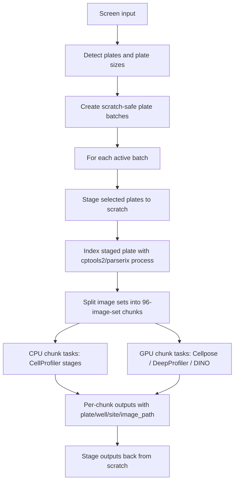

# Phase 2.5: Intra-Plate Batching and Fan-Out

## Objective

Restore cptools2's SGE-era intra-plate parallelism inside the Nextflow architecture so large plates are split into many scratch-safe jobs instead of one process per plate per stage.

## Scope

### Included:
- Define a stable chunk contract for plate, well, site, channel, image path, and chunk id.
- Use cptools2/parserix helper scripts inside Nextflow processes for ImageXpress parsing and image-set grouping.
- Generate per-chunk work manifests as part of the Nextflow graph.
- Submit many independent Nextflow tasks per plate for CellProfiler, Cellpose, and feature extraction stages.
- Preserve scratch-aware screen batching so only a safe set of plates is staged at once.
- Stage whole selected plates to scratch before intra-plate chunking.
- Preserve mandatory DataStore staging before compute.
- Preserve output metadata fields: `plate`, `well`, `site`, `image_path`, plus stage-specific output paths.
- Add smoke tests proving that a representative plate fans out into many tasks.
- Validate on Eddie with a small subset first, then the Sarah-screen representative plate.

### Explicitly NOT included:
- Downstream hit calling, aggregation, profiling, or analytics.
- Full DINO model implementation.
- Single-cell analytics beyond preserving per-object or per-site output compatibility.
- Replacing the legacy `generate` command.
- Rewriting CellProfiler pipelines unless the chunk contract exposes a specific incompatibility.
- Staging individual chunks directly from DataStore.

## Current Behaviour Gap

The current Nextflow graph is plate-level:

```text
plate -> STAGE_IN -> ILLUM_CALCULATE -> ILLUM_APPLY -> SEGMENTATION -> FEATURE_EXTRACT -> STAGE_OUT
```

That gives parallelism across plates, but not enough parallelism within a large plate. The SGE-native implementation split each plate into many jobs using image-set chunks, LoadData CSVs, and SGE arrays. The Nextflow revamp must recover that behaviour using channels and processes instead of generated SGE command files.

The current Python CLI also computes plate batches, but the active batch's plate list is not yet passed into each Nextflow invocation. That must be fixed so scratch-safe batches are real execution boundaries, not just printed metadata.

The target model has two batching layers:

1. **Outer plate batching**: cptools2 checks scratch and chooses which whole plates can be staged.
2. **Inner intra-plate chunking**: Nextflow fans a staged plate out into many chunk jobs.

## Target Architecture



## Key Deliverables

| Deliverable | Format | Location |
|-------------|--------|----------|
| Design spec | Markdown | `.claude/plans/2026-04-27-intra-plate-batching-design.md` |
| Chunk manifest schema | Markdown | `.claude/plans/phase-2.5-intra-plate-batching.md` |
| Parserix-backed helper scripts | Python | `cptools2/scripts/` or focused cptools2 modules |
| Batch-aware params generation | Python | `cptools2/__main__.py`, `cptools2/parse_yaml.py` |
| Chunking tests | Pytest | `tests/test_nextflow_chunking.py` |
| Nextflow chunk channels | DSL2 | `nextflow/main.nf` |
| Chunked CellProfiler process updates | DSL2 | `nextflow/modules/illum_apply.nf`, `nextflow/modules/segmentation.nf` |
| Chunked Cellpose and AI extraction processes | DSL2 | `nextflow/modules/cellpose_segmentation.nf`, `nextflow/modules/feature_extract.nf` |
| Eddie subset validation runbook | Markdown | `.claude/plans/2026-04-26-loop230-sarah-screen-runbook.md` |

## Chunk Manifest Contract

Minimum required columns:

| Column | Meaning |
|--------|---------|
| `plate` | Plate identifier, inferred from plate directory name unless configured otherwise |
| `well` | Well id parsed from ImageXpress filename |
| `site` | Site/field id parsed from ImageXpress filename |
| `channel` | Channel name or index |
| `image_path` | Scratch-local path after staging, never DataStore path for compute |
| `image_set_id` | Stable id for the well/site image set |
| `chunk_id` | Stable chunk id, for example `3723-D-100_chunk_0001` |
| `source_plate_path` | Original plate path, retained for traceability only |

The chunking unit should be image sets, not individual files. A Cell Painting site with five channels must stay together.

Expected chunk record emitted to Nextflow:

```groovy
tuple(
    val(chunk_id),
    val(plate),
    path(chunk_manifest_csv)
)
```

Processes may derive well/site groupings from the chunk manifest, but every output must keep enough metadata to join back to `plate`, `well`, `site`, and `image_path`.

Default chunk size is `96` image sets. This must be configurable, but `96` is the baseline for validation because it matches the legacy cptools2 default.

## Stage Compatibility

| Stage | Initial batching behaviour | Notes |
|-------|----------------------------|-------|
| `STAGE_IN` | Plate-level | Stage whole selected plates after outer scratch batching. |
| `BUILD_IMAGESET_INDEX` | Plate-level process | Runs cptools2/parserix inside Nextflow, emits image-set index. |
| `CHUNK_IMAGESETS` | Plate-level process emitting chunk files | Splits complete image sets into 96-image-set chunk manifests. |
| `ILLUM_CALCULATE` | Plate-level | Keep whole-plate initially for scientific correctness. |
| `ILLUM_APPLY` | Chunk-level | Consumes chunk manifest plus plate illumination functions. |
| `CELLPOSE_SEGMENT` | Chunk-level GPU | Required for AI feature extraction paths. |
| `CELLPROFILER_SEGMENT` | Optional chunk-level or plate-level baseline | Only needed for pure CellProfiler workflows. |
| `FEATURE_EXTRACT` | Chunk-level GPU | DeepProfiler first; Cell-DINO/uniDINO later. |
| `STAGE_OUT` | Plate/stage-level | Prefer staging outputs after chunk completion rather than per chunk. |

## Success Criteria

- [ ] A dry run for Sarah-screen plate `3723-D-100` produces a chunk manifest with many chunks, not one plate-level unit.
- [ ] Each chunk contains complete image sets, with all expected channels for a site.
- [ ] The CLI passes the active batch's plate list into each Nextflow run.
- [ ] DataStore-backed configs refuse compute unless `stage_data: true`.
- [ ] Nextflow emits one task per chunk for stages that can safely chunk.
- [ ] Cellpose is required for AI feature extraction paths.
- [ ] Pure CellProfiler-only workflows can run without Cellpose.
- [ ] CPU chunk tasks request `sharedmem` only when `cpus > 1`.
- [ ] GPU chunk tasks request `-q gpu -l gpu=1` and use `--nv`.
- [ ] Staging tasks run only on `-q staging` and do not request a PE.
- [ ] A subset run can limit execution to a small number of chunks for smoke testing.
- [ ] A chunk subset parameter, such as `max_chunks`, is available for Eddie smoke tests.
- [ ] Missing required channels fail before compute starts.
- [ ] Eddie validation shows multiple SGE jobs submitted for one plate.
- [ ] Outputs preserve `plate`, `well`, `site`, and `image_path`.
- [ ] The representative Sarah-screen plate can run without staging the whole screen at once.

## Dependencies

### Must Complete Before:
- Phase 2 container validation: complete; CellProfiler, DeepProfiler, and Cellpose-SAM SIFs exist and passed Eddie validation.
- Phase 2 staging implementation: complete enough for `STAGE_IN` and `STAGE_OUT`.

### Blocked By:
- A small Eddie validation subset to avoid burning scheduler time while iterating.

### Optional:
- DINO model documentation: useful for final AI extraction interface, not required for generic chunk fan-out.

## Skills Required

- `nextflow`: Channel transforms, tuple contracts, process resources, SGE executor behaviour.
- `python`: Parserix-backed helper scripts, metadata validation, CLI params generation.
- `eddie-hpc`: Staging queue, GPU queue, sharedmem PE, scratch monitoring.
- `cellprofiler`: LoadData/image-set semantics and chunk-safe pipeline execution.
- `testing`: Unit tests for chunk boundaries and smoke tests for Nextflow task fan-out.

## Risk Assessment

| Risk | Likelihood | Impact | Mitigation |
|------|------------|--------|------------|
| Chunking splits channels from the same site | Medium | High | Chunk by image-set id after parserix grouping, never by raw file count. |
| CellProfiler pipelines expect whole-plate context | Medium | Medium | Keep illumination calculate plate-level if needed; chunk only apply/segmentation/extraction first. |
| Nextflow publishes thousands of small files inefficiently | Medium | Medium | Publish per-chunk directories and stage final outputs in controlled batches. |
| Scratch fills during full plate test | High | High | Preserve plate batch limits and add pre-run projected usage reporting. |
| GPU queue saturates or over-submits | Medium | Medium | Set conservative `queueSize`, labels, and per-process `maxForks` if needed. |
| Legacy join assumptions break | Medium | Medium | Preserve chunk ids and LoadData-like metadata; add tests around output naming. |
| Cellpose is accidentally skipped for AI feature extraction | Medium | High | Encode engine compatibility rules in config validation and Nextflow branching tests. |

## Assumptions

- `parserix can parse Sarah-screen ImageXpress filenames`: This is already relied on by the SGE-native implementation and should be validated with fixture tests.
- `Image-set chunks are the right parallel unit`: This preserves channel grouping and maps cleanly to per-site feature extraction.
- `Illumination calculate remains plate-level initially`: It may need global plate context. We should not force chunking there until validated scientifically.
- `Feature extraction should initially be per-site or per-image-set`: This aligns with the user's stated target and avoids premature aggregation.
- `Cellpose is required for AI paths`: DeepProfiler, Cell-DINO, uniDINO, and related AI extractors depend on Cellpose segmentation outputs in this branch.

## Notes / Design Decisions

1. **Phase 2.5 is a substrate phase**: It should happen before the broader AI workflow contract phase, because DeepProfiler, Cell-DINO, uniDINO, and Cellpose all need the same execution contract.
2. **Batching has two layers**: screen-level plate batches protect scratch; intra-plate chunks create SGE parallelism.
3. **Nextflow replaces SGE arrays, not the chunking idea**: We should stop generating SGE command files for the new pipeline, but keep the proven split/load/metadata concepts.
4. **Staging remains non-optional**: DataStore paths should only be accessed from staging jobs. Compute and GPU jobs operate on scratch-local paths.
5. **Subset mode is required**: Loop 230 should be able to run the first N chunks of `3723-D-100` before the full plate.
6. **Cellpose is conditional, not universal**: It is mandatory for AI feature extraction paths, but not for pure CellProfiler-only baseline workflows.

## Ralph Loops

| Loop | Name | Type | Key Outputs |
|------|------|------|-------------|
| 240 | Chunk Contract and Stage Rules | Design | Manifest schema, chunk id convention, stage compatibility matrix |
| 250 | Nextflow Index and Chunk Processes | Implementation | Parserix-backed index process, chunk process, chunk-size controls, tests |
| 260 | Batch-Aware Nextflow Params | Implementation | Active batch plate list passed into Nextflow; dry-run shows selected plates/chunks |
| 270 | Chunked AI Pipeline Stages | Implementation | Chunked apply, Cellpose segmentation, and feature extraction modules |
| 280 | Eddie Scaling Validation | Validation | Subset run, then representative Sarah-screen plate with multiple SGE jobs |

## Deferred Decisions

- Whether `ILLUM_CALCULATE` should remain plate-level permanently or gain a separate chunkable mode.
- Whether DeepProfiler should consume corrected images by symlinked chunk directories or a chunk-level metadata file.

## GSTACK REVIEW REPORT

| Review | Trigger | Why | Runs | Status | Findings |
|--------|---------|-----|------|--------|----------|
| Eng Review | `/plan-eng-review` | Architecture, tests, performance | 1 | CLEAR | 3 plan issues found; all converted into Phase 2.5 requirements |

- **UNRESOLVED:** 0 blocking decisions. Two deferred implementation details remain documented above.
- **VERDICT:** ENG CLEARED, ready to turn into executable loops.
