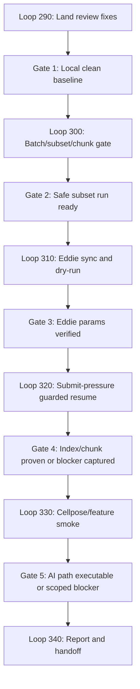

# Phase 2.6: Loop 230 Blocker Burn-Down

## Objective

Turn the current Loop 230 review fixes and Eddie validation blockers into a clean, executable path to a resumed Sarah-screen run.

## Scope

### Included:
- Land the current review-fix patch for scratch-contained Nextflow execution.
- Verify that stage-out uses durable destinations and does not republish large staged image folders.
- Confirm `max_chunks` or equivalent subset controls are available before running expensive Eddie jobs.
- Confirm the active scratch-safe plate batch is what each Nextflow invocation receives.
- Sync the local fix set to the shared Eddie group checkout.
- Resume Loop 230 on the Sarah-screen test plate with constrained Nextflow driver resources.
- Make Eddie submit-host pressure handling reproducible through documented `NXF_OPTS`, queue-size, and resume commands.
- Capture the exact remaining blocker if the representative run still cannot progress.

### Explicitly NOT included:
- Implementing DINO model extraction.
- Reworking CellProfiler scientific pipelines.
- Changing the selected representative plate.
- Solving cluster-wide Eddie scheduler pressure beyond reducing cptools2 submit pressure.
- Replacing the legacy `generate` command.

## Current State

The branch has already proved the important substrate pieces:

- Scratch-aware DataStore plate batching exists.
- Intra-plate image-set chunking exists with a default chunk size of `96`.
- The Nextflow graph reaches `STAGE_IN`, `BUILD_IMAGESET_INDEX`, `CHUNK_IMAGESETS`, `ILLUM_CALCULATE`, `ILLUM_APPLY`, `CELLPOSE_SEGMENT`, `FEATURE_EXTRACT`, and `STAGE_OUT`.
- Eddie full-run validation reached completed `STAGE_IN` and `ILLUM_CALCULATE`.

The active dirty tree contains review-fix work that should be landed before another Eddie run:

- `cptools2/__main__.py` passes `-work-dir <scratch>/work`.
- `cptools2/parse_yaml.py` emits `data_destination`.
- `nextflow/modules/illum_calculate.nf` and `nextflow/modules/cellpose_segmentation.nf` publish only intended output folders.
- `nextflow/modules/stage_out.nf` uses durable `data_destination` before scratch `output_dir`.
- `nextflow/main.nf` stages out Cellpose masks for AI segment-only paths.
- Tests cover the above behaviour.

## Key Deliverables

| Deliverable | Format | Location |
|-------------|--------|----------|
| Landed review-fix commit | Git commit | Local `ai-update` branch |
| Updated Eddie group checkout | Synced source tree | `/exports/cmvm/eddie/smgphs/groups/ChandranLabs/cptools2` |
| Subset validation controls | Code/tests or documented verified existing behaviour | `nextflow/main.nf`, helper scripts, tests, runbook |
| Eddie resume run evidence | Run log/status note | `.claude/plans/2026-04-28-loop230-progress-report.md` or new progress report |
| Remaining blocker report | Markdown | `.claude/plans/2026-04-29-loop230-blocker-burndown-report.md` |

## Success Criteria

- [ ] Current review-fix patch is committed locally without unrelated changes.
- [ ] Full local pytest suite passes after the patch.
- [ ] `git diff --check` is clean except acceptable Windows line-ending warnings.
- [ ] Subset mode is confirmed before a full representative run.
- [ ] Dry-run params prove the selected active batch plate list is passed into Nextflow.
- [ ] Eddie group checkout contains the same source/config files as the local blocker-fix commit.
- [ ] Eddie dry-run emits scratch-contained params with `-work-dir`, `stage_data: true`, `data_destination`, selected plate list, and chunk controls.
- [ ] Eddie runbook records the constrained submit-host settings used for Loop 230 resume.
- [ ] Eddie resume progresses at least through `BUILD_IMAGESET_INDEX` and `CHUNK_IMAGESETS`, or the precise blocker is documented with command, host, job id, and log path.

## Dependencies

### Must Complete Before:
- Phase 2.5 chunk fan-out implementation: Needed so Loop 230 can validate many jobs for one plate.
- Container validation: Needed for CellProfiler, Cellpose, and DeepProfiler process execution.

### Blocked By:
- Eddie account/scheduler pressure: Previous run failed at submit-host thread creation, not pipeline logic.
- Local Windows environment lacks `nextflow` on PATH: Runtime Nextflow validation must happen on Eddie unless Nextflow is installed locally.

### Optional:
- Seqera MCP review: Useful later for Nextflow style checks, not blocking this phase.

## Skills Required

- `review`: Confirm the review-fix patch addresses the known issues.
- `test-driven-development`: Keep regressions covered by focused tests.
- `eddie-orchestrate`: Plan and sequence Eddie sync/run work.
- `eddie-login`: Run login-node dry-runs and Nextflow resume commands.
- `eddie-validate`: Check queue/profile/resource assumptions.
- `progress-report`: Record final state and remaining blockers.

## Risk Assessment

| Risk | Likelihood | Impact | Mitigation |
|------|------------|--------|------------|
| Stage-out still writes only to scratch | Medium | High | Test `data_destination` param emission and inspect generated params on Eddie. |
| PublishDir copies staged image folders again | Low | High | Keep publish `pattern` tests for illumination and Cellpose modules. |
| Subset control is missing or ineffective | Medium | Medium | Make this its own loop before full resume. |
| Eddie scheduler pressure masks real pipeline bugs | High | Medium | First run dry-run/subset, record host, qstat, Nextflow log, and exact failing process. |
| GPT-5.4-mini subagents over-edit shared files | Medium | Medium | Give each loop a narrow ownership scope and forbid unrelated refactors. |
| Local and Eddie checkouts drift | Medium | High | Verify commit hash or file checksums after sync. |

## Assumptions

- `3723-D-100 remains the representative plate`: It is large but realistic and already staged/cached in parts.
- `Scratch project path remains /exports/eddie/scratch/mharvey2/cptools2-loop230`: Existing params and cached work use this location.
- `Shared group checkout remains canonical for Eddie execution`: `/exports/cmvm/eddie/smgphs/groups/ChandranLabs/cptools2`.
- `GPT-5.4-mini is suitable for bounded loops`: The loops must be constrained, testable, and avoid broad architectural rewrites.

## Notes / Design Decisions

1. This is a burn-down phase, not a feature phase.
2. The first goal is to remove self-inflicted blockers: scratch work dir, publish scope, durable stage-out, and AI segment-only routing.
3. The second goal is to reduce Eddie validation cost: prove chunk generation with subset controls before full Cellpose/feature extraction.
4. The third goal is clean evidence: if Eddie still fails, the report should separate scheduler pressure from pipeline failures.

## Advanced Planning Architecture

### Control Plane

The parent agent is the control plane. It owns:

- Phase status and loop sequencing.
- Git commits.
- Shared Eddie state.
- Final integration decisions.
- Conflict resolution between subagents.

GPT-5.4-mini subagents are execution workers. They receive one loop at a time, a bounded file scope, and observable verification criteria. They do not decide phase direction, push code, or run broad refactors.

### Dependency Graph

Loop 300 can start read-only before Loop 290 lands, but it cannot edit overlapping files until Loop 290 has committed. Loops 310, 320, 330, and 340 are sequential.

### Hard Dependencies

| Loop | Depends On | Blocked By | Unlocks |
|------|------------|------------|---------|
| 290 | Current dirty tree | Local test failure, unrelated diff mixed into patch | 300 write mode, 310 |
| 300 | 290 for edits; none for read-only inspection | Missing subset design decision, failing batch/chunk tests | 310 dry-run with safe subset |
| 310 | 290 and 300 | Eddie login unavailable, sync mismatch, dry-run params mismatch | 320 |
| 320 | 310 | Eddie submit-host pressure, missing chunk params, Nextflow cache/path mismatch | 330 |
| 330 | 320 | GPU queue unavailable, Cellpose scaffold gap, model/container input mismatch | 340 |
| 340 | 290-330 complete or explicitly blocked | Missing evidence from prior loops | Phase verdict |
 
### Write Ownership Rules

Loop 290 owns the current dirty patch and must land first. Loop 300 may inspect overlapping files in parallel, but if it needs edits to `cptools2/__main__.py`, `cptools2/parse_yaml.py`, `nextflow/main.nf`, or `tests/test_nextflow_architecture_smoke.py`, it must wait until Loop 290 is committed and rebase its proposed change on that baseline.

No two GPT-5.4-mini workers may edit the same file at the same time. Eddie loops do not run in parallel because they share remote state, scratch work, and scheduler pressure.

### Execution Lanes

| Lane | Loops | Agent Model | Can Run In Parallel? | Owner | Notes |
|------|-------|-------------|----------------------|-------|-------|
| Local baseline | 290 | GPT-5.4-mini | No | Parent + worker | Establishes clean commit before other edits. |
| Local validation | 300 | GPT-5.4-mini | Read-only with 290 | Worker | May become editing loop only after 290 lands. |
| Eddie sync | 310 | GPT-5.4-mini | No | Parent + Eddie worker | Touches shared group checkout. |
| Eddie resume | 320 | GPT-5.4-mini | No | Eddie worker | Uses scheduler state and cached work. |
| AI smoke | 330 | GPT-5.4-mini | No | Eddie worker | Depends on chunk subset success. |
| Handoff | 340 | GPT-5.4-mini | No | Parent + doc worker | Produces final phase verdict. |

### Quality Gates

| Gate | Required Evidence | Failure Action |
|------|-------------------|----------------|
| Gate 1: Local clean baseline | Focused tests pass, full pytest passes, `git diff --check` clean, review-fix commit exists | Stop before Eddie sync; fix local patch. |
| Gate 2: Safe subset run ready | Params expose active plates and chunk limit, default full-run behaviour unchanged | Add subset control or document why existing control is sufficient. |
| Gate 3: Eddie params verified | Shared checkout matches local commit/files, dry-run writes scratch-contained params | Do not resume; fix sync or params mismatch. |
| Gate 4: Index/chunk proven | `BUILD_IMAGESET_INDEX` and `CHUNK_IMAGESETS` complete, chunk manifests exist | Capture exact blocker and decide whether to patch or wait for scheduler. |
| Gate 5: AI path executable | One chunk Cellpose/feature smoke succeeds, or exact scaffold/container/model blocker is documented | Convert blocker into next phase/loop item. |
| Gate 6: Handoff complete | Report exists, PLANS-INDEX current, next action unambiguous | Do not claim Phase 2 complete. |

### Failure Recovery

| Failure Mode | Detection | Recovery |
|--------------|-----------|----------|
| Subset control missing | Loop 300 cannot find a YAML-to-params-to-Nextflow chunk limit | Add minimal `max_chunks` support with tests, or stop before Eddie execution if implementation exceeds loop scope. |
| Active batch not passed to Nextflow | Dry-run params lack selected `plates`, `batch_id`, or protected size fields | Patch params generation before any remote sync. Do not run Eddie with ambiguous plate selection. |
| Dry-run params mismatch on Eddie | Local params and Eddie params differ for paths, containers, `stage_data`, `data_destination`, or selected plates | Stop at Loop 310, resync checkout/config, regenerate params, and record exact mismatch. |
| Eddie submit-host pressure persists | `qsub` or JVM fails with thread/resource errors before process execution | Pause execution, record `qstat`/host/logs, keep scratch/cache state, retry only when account pressure is lower. |
| Cellpose path is scaffold-only | Loop 330 finds placeholder commands or missing model invocation | Do not label AI path complete. Convert to next implementation loop with exact command/input contract. |

### Decision Audit Trail

Each loop completion report must record decisions in this format:

| Decision | Classification | Principle | Rationale | Rejected Alternative |
|----------|----------------|-----------|-----------|----------------------|
| Example: use subset before full Sarah-screen run | Auto-decided | Reduce blast radius | A representative plate is expensive and scheduler-sensitive | Full run first |

Decision classifications:

- `auto-decided`: Clear engineering choice with low ambiguity.
- `lead-input-needed`: Requires project lead judgment.
- `blocked`: External state prevents execution.
- `deferred`: Useful but not needed for Loop 230 burn-down.

### Subagent Handoff Contract

Every GPT-5.4-mini subagent returns:

- `changed_files`: Exact paths edited, or `none`.
- `commands_run`: Exact commands and exit codes.
- `evidence`: Test output, params path, job id, log path, or file path.
- `job_ids`: Eddie/SGE job ids if any, or `none`.
- `log_paths`: Nextflow, SGE, pytest, or scratch log paths, or `none`.
- `blockers`: Exact failure text and where it came from.
- `next_owner`: `parent`, `gpt-5.4-mini-worker`, `eddie-worker`, or `lead`.
- `handoff_summary.done`: One sentence.
- `handoff_summary.failed`: One sentence or empty.
- `handoff_summary.needed`: One sentence naming the next first action.

### Model Routing

| Work Type | Model | Reason |
|-----------|-------|--------|
| Phase plan edits | Parent model | Needs full project context and lead intent. |
| Bounded local verification | GPT-5.4-mini | Clear commands and small file scope. |
| Narrow implementation patch | GPT-5.4-mini | Safe when owned files are explicit. |
| Eddie command execution | GPT-5.4-mini with parent review | Commands are concrete but environment-sensitive. |
| Final phase verdict | Parent model | Needs synthesis across all loop outcomes. |

### Final Acceptance Gate

Phase 2.6 is complete only when all of the following are true:

- [ ] Loop 290 is complete and committed locally.
- [ ] Loop 300 confirms active batch params and subset controls, or records a scoped implementation blocker.
- [ ] Loop 310 confirms Eddie sync and dry-run params, or records a remote access/sync blocker.
- [ ] Loop 320 proves index/chunk execution, or records an Eddie/runtime blocker with command, host, job id where available, and log path.
- [ ] Loop 330 proves one-chunk Cellpose/feature smoke, or records a scaffold/container/model blocker.
- [ ] Loop 340 writes `.claude/plans/2026-04-29-loop230-blocker-burndown-report.md`.
- [ ] `PLANS-INDEX.md` links the phase and loop files.
- [ ] Final verdict is one of: `Phase 2 complete`, `Phase 2 blocked by Eddie environment`, or `Phase 2 continues with implementation blocker`.

## Ralph Loops

| Loop | Name | Type | Key Outputs |
|------|------|------|-------------|
| 290 | Land Local Review Fixes | Implementation | Local commit, full pytest pass, clean diff check |
| 300 | Batch, Subset, and Chunk Validation Gate | Implementation/Validation | Confirm active batch params and subset controls, tests, dry-run evidence |
| 310 | Eddie Sync and Dry-Run | Infrastructure | Shared group checkout updated, params verified, Nextflow preview/dry-run evidence |
| 320 | Eddie Submit-Pressure Guard and Resume | Validation | Resume Loop 230 through index/chunk stages under constrained submit-host settings, or precise blocker report |
| 330 | Cellpose/Feature Extract Smoke | Validation | Small chunk AI path smoke or documented model/container blocker |
| 340 | Progress Report and Phase Handoff | Documentation | Burn-down report, updated plan status, next recommended phase |

## Subagent Strategy

These loops are designed for GPT-5.4-mini subagents. Each subagent must:

- Work on one loop only.
- Treat the repository as shared and avoid reverting changes from others.
- Keep edits inside the loop's stated file scope.
- Run the loop's verification commands.
- Return changed files, commands run, results, blockers, and exact next handoff.

Parallelism is allowed only where file scopes and Eddie state do not overlap. Loops 290 and 300 may run in parallel only if 300 is read-only at first. Loops 310, 320, and 330 must run sequentially because they share Eddie state and cached Nextflow work.
