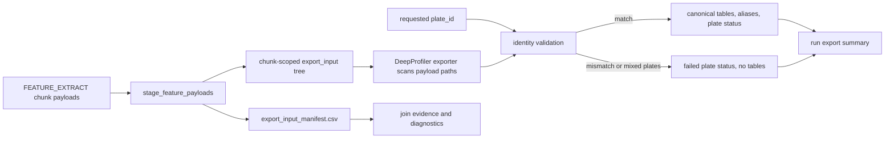

# DeepProfiler Plate Identity Hardening Design

## Context

Phase 2.9 proved the clean full-plate DeepProfiler route through Eddie after
the plate-level export join repair. `FEATURE_EXTRACT` now emits explicit
`plate_id`, `chunk_id`, and chunk feature payloads, `EXPORT_FEATURES` stages
those payloads into collision-proof chunk-scoped directories, and the exporter
writes plate-level CSV tables.

The Phase 2.9 code review identified one remaining integrity weakness in the
DeepProfiler exporter. When callers pass an explicit `plate_id`, the exporter
currently applies that plate id while inferring row metadata from each `.npz`
path. The later mismatch check therefore sees already relabeled metadata rather
than the plate identity preserved by the payload path.

## Problem

`plate_id` currently acts as both:

1. a caller assertion about which plate the export task should publish; and
2. a metadata override used before the exporter validates the staged payloads.

That weakens the exporter boundary. A wrong grouped payload, stale staged
payload, or manual CLI backfill with the wrong `--plate-id` can be relabeled
before the mismatch validation runs.

This does not invalidate the successful Phase 2.9 full-plate run. It means the
export boundary is less defensive than intended for future multi-plate and
recovery workflows.

## Goal

Harden the DeepProfiler export boundary so export-ready tables are published
only when workflow routing and payload identity agree, while keeping the
successful Phase 2.9 join path simple, diagnosable, and tolerant of
plate-local export failures across a multi-plate run.

## Selected Design

### Identity Model

The exporter must treat identity sources differently:

| Identity Source | Role |
| --- | --- |
| DeepProfiler `.npz` payload path | Primary observed measurement identity |
| Nextflow or CLI `plate_id` | Caller assertion and publication target |
| Staged export input manifest | Join audit trail and chunk routing evidence |

DeepProfiler payload paths remain the authoritative validation source for the
current exporter because the certified native payload shape preserves plate,
well, and site:

```text
features/<plate>/<well>/<site>.npz
```

The explicit `plate_id` must never overwrite observed payload metadata before
validation.

### Join Manifest

The export staging helper should write a small staged input manifest while it
copies feature payloads into chunk-scoped directories. The staging copy should
live under the export input directory and describe the join input that the
exporter received. `EXPORT_FEATURES` should also preserve that manifest with
the exported feature artifacts so stage-out keeps the join evidence after the
work directory is no longer the primary result location.

Initial columns:

```text
plate_id
chunk_id
source_feature_dir
staged_feature_dir
```

`EXPORT_FEATURES` should pass its plate-level `plate_id` into staging so the
manifest records the plate group assembled by Nextflow. Existing staging checks
remain required:

- staged `plate_id` must be non-empty;
- chunk id count must match feature directory count;
- duplicate chunk ids must fail before copying;
- missing feature payload directories must fail;
- reruns must replace stale chunk-scoped payloads.

The manifest improves auditability and error investigation. It does not replace
payload validation in the DeepProfiler exporter because its plate id originates
from workflow routing.

### Payload Validation

DeepProfiler export should:

1. scan `.npz` payloads without applying the requested `plate_id`;
2. infer `Metadata_Plate`, `Metadata_Well`, and `Metadata_Site` from each
   payload path;
3. collect observed plate ids for exportable, missing-feature, and unsupported
   `.npz` schemas;
4. reject mixed observed plate ids in one plate export;
5. when `plate_id` is supplied, reject any mismatch between the requested and
   observed plate id;
6. only after validation, use the validated plate id for published alias names.

The canonical table content should keep the payload-derived
`Metadata_Plate`. The validated plate id controls the plate-aware alias names.

### Failure Policy

Normal DeepProfiler export is strict:

- one plate export task may contain one observed plate only;
- requested and observed plate ids must agree when a request plate id exists;
- malformed payload layouts that cannot expose the expected DeepProfiler plate
  folder should fail with a clear path-contract error rather than silently
  trusting the caller.

No fallback mode is added in this hardening fix. If a later real workflow needs
flattened or legacy payload export, that recovery path must be explicit and
auditable, for example a manifest-backed recovery mode or an opt-in trust flag.

### Partial-Success Workflow Policy

Strict export validation must not turn one bad plate into a silent loss of all
other plate exports. Plate-local export failures should be represented as data
that the workflow can carry forward:

- a plate that validates publishes feature tables and an export status artifact;
- a plate that fails identity or payload validation publishes no measurement
  tables, but still publishes a status artifact and a short plate README;
- other plate export tasks continue and may publish their validated tables;
- a run with plate-local export failures may still complete successfully, but
  its outputs must make the partial result visible.

The preferred normal path is for `EXPORT_FEATURES` to catch expected
plate-local export validation failures and emit a structured failed status
instead of losing the plate result channel. The process may additionally use a
non-fatal Nextflow failure policy for unexpected process-level crashes, but the
run summary must distinguish a plate with an explicit failed status from a plate
whose export status is missing.

### Export Status And User Report

Each plate export should emit a compact machine-readable status artifact and a
short human-readable README even when it does not produce tables.

Per-plate status fields should include:

```text
plate_id
export_status
failure_stage
failure_reason
tables_present
manifest_path
```

The README should say whether validated export tables exist, where they are
expected, and what to inspect when export failed. Empty table directories must
not be the only failure signal.

A run-level export summary should combine expected plate ids with observed
per-plate export statuses. It should write:

```text
feature_export_summary.csv
README.md
```

The summary README should report counts for successful, failed, and
missing-status plate exports and list failed plate ids with the concise failure
reason. The CSV should keep one row per expected plate so users running outside
Eddie can immediately distinguish:

- exported tables available;
- plate export failed with a recorded reason;
- plate export produced no status artifact because the task crashed or never
  completed.

### Data Flow



## Alternatives Considered

### Payload Validation Only

This is the smallest repair. It fixes the relabel-before-validation bug, but it
leaves the plate join less transparent when debugging staged chunk inputs.

### Join Manifest As Source Of Truth

A manifest alone cannot independently prove measurement identity if its
`plate_id` is copied from the same workflow routing label that was wrong.
Using it as the sole authority would preserve the current trust problem in a
different file.

### Permissive Default With Strict Mode

A permissive default would preserve ad hoc relabeling for flattened payloads,
but export-ready measurement tables should fail when identity cannot be
verified. Recovery support can be added later behind an explicit user choice if
there is a concrete caller.

## Error Handling

Errors should distinguish the likely failure boundary:

- malformed path: state the expected DeepProfiler payload shape;
- mixed observed plates: list observed plate ids;
- requested mismatch: list requested plate id and observed plate ids;
- staging manifest failure: identify duplicate chunk ids, missing payload
  directory, or manifest write problem;
- run summary missing status: name the plate id whose export task did not
  produce an explicit status artifact.

## Tests

Focused local tests should cover:

- `stage_feature_payloads()` writes a staged manifest with plate and chunk
  routing information;
- empty staged `plate_id` fails before the join manifest is written;
- staged manifest paths point at chunk-scoped copies;
- `EXPORT_FEATURES` preserves the manifest with exported feature artifacts;
- existing duplicate, missing payload, and stale rerun staging behavior remains
  intact;
- explicit matching `plate_id` still writes plate aliases;
- explicit wrong `plate_id` rejects a payload from another observed plate;
- mixed observed payload plates reject export even with a requested `plate_id`;
- canonical table rows keep payload-derived `Metadata_Plate`;
- failed plate exports emit a failed status and README without measurement
  tables;
- successful plate exports emit a success status and README with table
  locations;
- run-level summary covers success, recorded failure, and missing-status plate
  cases;
- existing Nextflow architecture tests prove `EXPORT_FEATURES` passes plate
  identity into staging, still passes `--plate-id` into the exporter, and keeps
  export summary wiring visible.

The existing successful Eddie full-plate run remains the runtime evidence for
the repaired Phase 2.9 route. Re-running Eddie is not required for this narrow
local exporter hardening unless review or tests expose a pipeline contract
change that local coverage cannot certify.

## Out Of Scope

- streaming Parquet memory hardening from the separate Phase 2.9 code review
  follow-up;
- generic identity abstractions for future non-DeepProfiler extractors;
- a permissive legacy export or manual trust mode;
- changing full-plate DeepProfiler GPU scheduling or stage-out behavior.

## Success Criteria

- The exporter can no longer silently relabel wrong-plate DeepProfiler payloads
  when callers pass `plate_id`.
- The staged join input records plate and chunk routing in a manifest useful for
  diagnostics.
- One plate-local export failure does not prevent other validated plate exports
  from being produced.
- Successful runs with partial plate export failures include per-plate and
  run-level status artifacts that make missing tables understandable.
- Existing full-plate export naming, CSV output contract, and chunk-collision
  repair remain intact.
- Focused tests fail on wrong payload identity and pass on the current certified
  payload layout.
